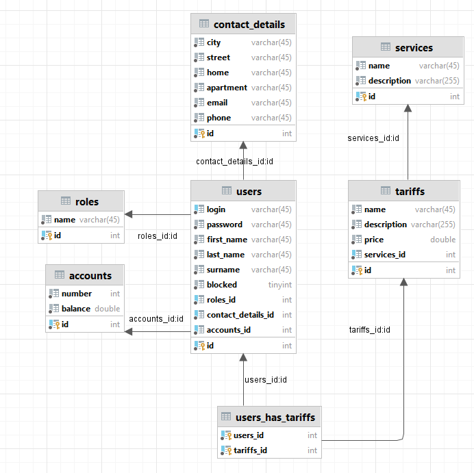

### Final project for EPAM Java external courses

# Internet provider

The Administrator registers the Subscriber in the system.

The Subscriber is provided with a list of Services (Telephone, Internet, Cable TV, IP-TV, etc.) and a list of Tariffs for each service. Implement the ability to download tariff plans in one of the formats (eg, txt, pdf, docx). For the list of tariffs to implement the possibility of sorting by:
- alphabetically / in reverse order (a-z, z-a);
- by price.
  The subscriber can choose one or more services at a certain rate. The subscriber has an account that he can replenish. Funds are withdrawn from the account by the system depending on the tariff plans selected by the subscriber. If the amount in the account is not enough, the system blocks the user.
  The user is automatically unlocked by making the required amount to the account.
  The system administrator has the rights:
- add, delete or edit a tariff plan;
- user registration, blocking and unblocking.

## **_Used technologies_**
  Java EE
*   Servlets
*   Filters
*   Listeners
*   JSP
  
  MySql

##   **_Used patterns_**

  MVC
  DAO
  Abstract factory for dao for different users
  Singleton for ConnectionPool
  
## **_Builder_**

  Set up project
  Clone current repository
  Set your database connect rules in restaurant/src/main/webapp/META-INF/context.xml
  Run internetprovider/src/main/resources/sql/create_db.sql to set up database on your devise
  Run internetprovider/src/main/resources/sql/insert_test_data.sql to insert data for testing purposes
  Run app using servlet container (Recommended Tomcat v.9.0.68)
  Use app in your browser
  
## **_Database schema_**

